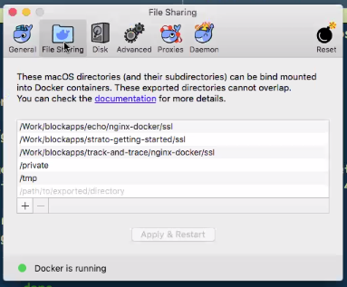
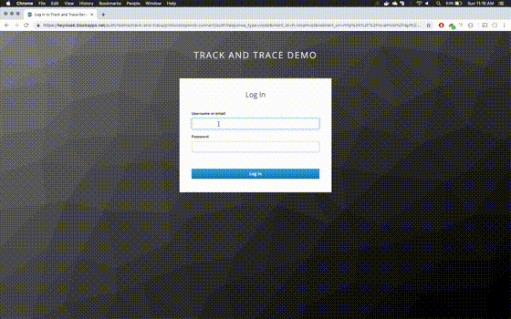
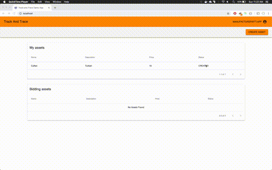
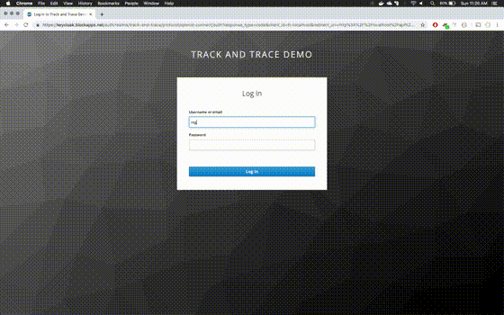

# Track and Trace Demo App

Demo app that uses STRATO to track products through a supply chain using OAuth and Private chains.

## Setup

### Pre-requisites

1. Install Docker from https://www.docker.com
2. Install `docker-compose` from https://docs.docker.com/compose/install/
3. STRATO node running with OAuth parameters:
    ```
    OAUTH_JWT_VALIDATION_ENABLED=true
    OAUTH_STRATO42_FALLBACK=true
    OAUTH_JWT_USERNAME_PROPERTY=email
    OAUTH_JWT_VALIDATION_DISCOVERY_URL=https://keycloak.blockapps.net/auth/realms/track-and-trace/.well-known/openid-configuration
    ```

### Deploy STRATO locally

Skip this step if STRATO is deployed on remote machine.

#### Clone strato-getting-started:

```
git clone https://github.com/blockapps/strato-getting-started.git
cd strato-getting-started
```

#### Run following command to start STRATO:

```
HTTP_PORT=8080 NODE_HOST=localhost:8080 OAUTH_JWT_VALIDATION_ENABLED=true OAUTH_STRATO42_FALLBACK=true OAUTH_JWT_VALIDATION_DISCOVERY_URL=https://keycloak.blockapps.net/auth/realms/track-and-trace/.well-known/openid-configuration OAUTH_JWT_USERNAME_PROPERTY=email ./strato.sh --single

```

### Run track and trace application locally

#### Clone track and trace demo application:

```
cd ..
git clone https://github.com/blockapps/track-and-trace.git
git submodule update --init --recursive
```

#### Token setup:

```
cd track-and-trace/server
```

Now create `.env` file and add all the tokens here. [Copy tokens only](README.md#tokens)

#### SSL mounting (Only for older versions of OS X - pre Sierra):

Add the following path to docker's file sharing settings:

```
<root-dir>/blockapps/track-and-trace/nginx-docker/ssl
```



#### Running project for demo using docker

To run application against the STRATO node running locally (uses config `server/config/localhost.config.yaml` by default):

```
docker-compose up -d
```

To run application with the custom configuration - create the new config file at `server/config/mycustomconfig.config.yaml` and run application as follows:
```
SERVER=mycustomconfig docker-compose up -d
```
This will make the application use `server/config/mycustomconfig.config.yaml` configuration file instead of the default.

#### Running project for development using OAuth

Wait for all containers to report healthy status in the output of `docker ps`

##### Install dependencies

```
cd server
git submodule update --init --recursive
yarn build
```

##### Start api server

```
yarn install
yarn deploy
yarn start
```

##### Start UI

```
cd ui
yarn install
REACT_APP_URL=http://localhost:3030 yarn start
```

##### Start nginx

```
cd nginx-docker
HOST_IP=$(ipconfig getifaddr en0) docker-compose up -d
```

**Note:** Your interface might be different

Your ip can be obtained by `ifconfig`.

### Usernames for oauth server

administrator@tt.app
distributor@tt.app
manufacturer@tt.app
master@tt.app
regulator@tt.app
retailer@tt.app

Password for all users is `1234`

### Tokens

This app uses oauth for authentication. To get admin token and master tokens, use

```
cd server
yarn install
sudo PORT=80 yarn token-getter
```

Then open a browser and goto http://localhost to obtain tokens for the admin and master users.

These tokens can be provided on the command line as `ADMIN_TOKEN` and `MASTER_TOKEN` respectively. The recommended way is to store these tokens in the `.env` file under the `/server` folder. A valid `.env` file is as follows:

```
ADMIN_TOKEN=eyJhbGciOiJSUzI1NiIsInR5cCIgOiAiSldUIiwia2lkIiA6ICJTTlRQNXpMTzNHVVhtdzhxRGRNazlDYnY5LUZNeUFhY1JTWmRoUExQaWVFIn0.eyJqdGkiOiI3ZDljMTc1ZS0zMDU2LTRhOGItOGYxYy05M2RhM2JiMGRiZmEiLCJleHAiOjE5ODE2MTMzNTIsIm5iZiI6MCwiaWF0IjoxNTQ5NjEzMzUzLCJpc3MiOiJodHRwczovL2tleWNsb2FrLmJsb2NrYXBwcy5uZXQvYXV0aC9yZWFsbXMvdHJhY2stYW5kLXRyYWNlIiwiYXVkIjoiYWNjb3VudCIsInN1YiI6ImU2NTEyZTcwLWI4ZTYtNDlmZC1hYmJjLTUzZjRhYjg1MWQwMyIsInR5cCI6IkJlYXJlciIsImF6cCI6InR0LWxvY2FsaG9zdCIsImF1dGhfdGltZSI6MTU0OTYxMzM1Miwic2Vzc2lvbl9zdGF0ZSI6IjY2MzgyYTkwLWY0MzYtNDgxMS05YjNhLTRjNDgwY2EzOWU1OCIsImFjciI6IjEiLCJhbGxvd2VkLW9yaWdpbnMiOlsiaHR0cDovL2xvY2FsaG9zdCJdLCJyZWFsbV9hY2Nlc3MiOnsicm9sZXMiOlsib2ZmbGluZV9hY2Nlc3MiLCJ1bWFfYXV0aG9yaXphdGlvbiJdfSwicmVzb3VyY2VfYWNjZXNzIjp7ImFjY291bnQiOnsicm9sZXMiOlsibWFuYWdlLWFjY291bnQiLCJtYW5hZ2UtYWNjb3VudC1saW5rcyIsInZpZXctcHJvZmlsZSJdfX0sInNjb3BlIjoib3BlbmlkIHByb2ZpbGUgZW1haWwiLCJlbWFpbF92ZXJpZmllZCI6ZmFsc2UsIm5hbWUiOiJUcmFjayBhbmQgVHJhY2UgQWRtaW5pc3RyYXRvciIsInByZWZlcnJlZF91c2VybmFtZSI6ImFkbWluaXN0cmF0b3JAdHQuYXBwIiwiZ2l2ZW5fbmFtZSI6IlRyYWNrIGFuZCBUcmFjZSIsImZhbWlseV9uYW1lIjoiQWRtaW5pc3RyYXRvciIsImVtYWlsIjoiYWRtaW5pc3RyYXRvckB0dC5hcHAifQ.CiJSG0BlwIN0HJXLZmzvajNXezu47-vQDWu1zGxxXF40rxxxlXTSEMLJMHi0XTJuqTEZ3dQAAow3qWvtRgzQK3zzMuBkd9BllcL1whQkqJ5F30QtiI799shtg89aokdNOflc8IcSTnjBLlonetTldhqotEbqBX-iZDPdjC1ql_5bOcFWv1LpSRUJlwUlTHWcxomd3ZUDzRmsl4DGl3PqsOrIxzbVqRCpHFA_E9ofBoC_KN7Aruq5HkB27IWz97Bne2WNNm_KuzWoWBAYxALUZQPCzx5xBGaV5iax6IChqP2scJsRPyJRZFakXJ0B3f3BOKr5WU-FSwh38v7j4uBfGw
MASTER_TOKEN=eyJhbGciOiJSUzI1NiIsInR5cCIgOiAiSldUIiwia2lkIiA6ICJTTlRQNXpMTzNHVVhtdzhxRGRNazlDYnY5LUZNeUFhY1JTWmRoUExQaWVFIn0.eyJqdGkiOiJkMmM5M2Q3MS03NmFhLTQxNGYtODg5Yi01MDExNmZiYTYxMjMiLCJleHAiOjE5ODA4NzM2ODEsIm5iZiI6MCwiaWF0IjoxNTQ4ODczNjgxLCJpc3MiOiJodHRwczovL2tleWNsb2FrLmJsb2NrYXBwcy5uZXQvYXV0aC9yZWFsbXMvdHJhY2stYW5kLXRyYWNlIiwiYXVkIjoiYWNjb3VudCIsInN1YiI6Ijg5MTRhOWJmLTRlMzctNDI5Zi05MjdlLWU5OWE4NDFiMzlmNCIsInR5cCI6IkJlYXJlciIsImF6cCI6InR0LWxvY2FsaG9zdCIsImF1dGhfdGltZSI6MTU0ODg3MzY4MSwic2Vzc2lvbl9zdGF0ZSI6ImI5OTE2Mzc0LTRkZDktNDQ3Zi1hNTEwLTcwMWYyZTE3MWViYyIsImFjciI6IjEiLCJhbGxvd2VkLW9yaWdpbnMiOlsiaHR0cDovL2xvY2FsaG9zdCJdLCJyZWFsbV9hY2Nlc3MiOnsicm9sZXMiOlsib2ZmbGluZV9hY2Nlc3MiLCJ1bWFfYXV0aG9yaXphdGlvbiJdfSwicmVzb3VyY2VfYWNjZXNzIjp7ImFjY291bnQiOnsicm9sZXMiOlsibWFuYWdlLWFjY291bnQiLCJtYW5hZ2UtYWNjb3VudC1saW5rcyIsInZpZXctcHJvZmlsZSJdfX0sInNjb3BlIjoib3BlbmlkIHByb2ZpbGUgZW1haWwiLCJlbWFpbF92ZXJpZmllZCI6ZmFsc2UsIm5hbWUiOiJUcmFjayBhbmQgVHJhY2UgTWFzdGVyIiwicHJlZmVycmVkX3VzZXJuYW1lIjoibWFzdGVyQHR0LmFwcCIsImdpdmVuX25hbWUiOiJUcmFjayBhbmQgVHJhY2UiLCJmYW1pbHlfbmFtZSI6Ik1hc3RlciIsImVtYWlsIjoibWFzdGVyQHR0LmFwcCJ9.ImfWGcp0tkfLpVnwhy2X7Liy2zHe2AZc7ewoQaA-KX_oifia-0RzuYZL6odOGGfEcT-lPQetNnSl1WJ7EvH-E9ca7YGRljQHoNVIdb9i7mKQA_v9Ev_bc87IVBCCFh6sQjLJb2aqt4I9NPOO3FDS7G4ww9aO1bf2Od3Trcdlj6_RXvoE6_MkZWe2twa-clfbOmBP-vf_4pzf3Diymj4boSoquavV3dBf36VsFySyvFo0_xsmguIrdStD85xQwGD7ombzwkuQTuqT8NvwEWkfshc2afx0glNjjOMXgWke69ZGL2IzRpiqO9X3_NrDs4zQCKoRdz6SUDsQCwT4iAydlw
DISTRIBUTOR_TOKEN=eyJhbGciOiJSUzI1NiIsInR5cCIgOiAiSldUIiwia2lkIiA6ICJTTlRQNXpMTzNHVVhtdzhxRGRNazlDYnY5LUZNeUFhY1JTWmRoUExQaWVFIn0.eyJqdGkiOiJmNzI5NjlmMS1lMjEzLTRkYzktYmJjYS1mY2U2ZjQ2NTQxNzQiLCJleHAiOjE5ODA5MzczNTEsIm5iZiI6MCwiaWF0IjoxNTQ4OTM3MzUxLCJpc3MiOiJodHRwczovL2tleWNsb2FrLmJsb2NrYXBwcy5uZXQvYXV0aC9yZWFsbXMvdHJhY2stYW5kLXRyYWNlIiwiYXVkIjoiYWNjb3VudCIsInN1YiI6IjE5ZDcxNDBiLWQxNDgtNGQyOS04YWI3LWU0YWY3OWJkYjcyYiIsInR5cCI6IkJlYXJlciIsImF6cCI6InR0LWxvY2FsaG9zdCIsImF1dGhfdGltZSI6MTU0ODkzNzM1MSwic2Vzc2lvbl9zdGF0ZSI6IjdmYzE0MTAxLWJmODgtNDc1ZC1hNDc5LWJjMzlkZmJmYTdhMCIsImFjciI6IjEiLCJhbGxvd2VkLW9yaWdpbnMiOlsiaHR0cDovL2xvY2FsaG9zdCJdLCJyZWFsbV9hY2Nlc3MiOnsicm9sZXMiOlsib2ZmbGluZV9hY2Nlc3MiLCJ1bWFfYXV0aG9yaXphdGlvbiJdfSwicmVzb3VyY2VfYWNjZXNzIjp7ImFjY291bnQiOnsicm9sZXMiOlsibWFuYWdlLWFjY291bnQiLCJtYW5hZ2UtYWNjb3VudC1saW5rcyIsInZpZXctcHJvZmlsZSJdfX0sInNjb3BlIjoib3BlbmlkIHByb2ZpbGUgZW1haWwiLCJlbWFpbF92ZXJpZmllZCI6ZmFsc2UsIm5hbWUiOiJUcmFjayBhbmQgVHJhY2UgRGlzdHJpYnV0b3IiLCJwcmVmZXJyZWRfdXNlcm5hbWUiOiJkaXN0cmlidXRvckB0dC5hcHAiLCJnaXZlbl9uYW1lIjoiVHJhY2sgYW5kIFRyYWNlIiwiZmFtaWx5X25hbWUiOiJEaXN0cmlidXRvciIsImVtYWlsIjoiZGlzdHJpYnV0b3JAdHQuYXBwIn0.FB6PvKPFYJvJ8QflJS1v_zxP427R79aa9_28mbUd9mfRAofMhhBMTJXoXeptY96Qlvc8L0TuLdtufeBQAQJrhYKfe4qCDYqg6ACSPyhC-YH482_-6l-ZANPieD006EBJ1JwBmG4so6G5uYlLxlNaufbvQh-l_hUl5TpKJXnRJoTf4KeP8KIrDnuLsS5reB3it-kO7lWf8kZoMVVgy6Cq6t8AvKfwyIyW55VO7GTNHd0FFpnX11a7apNMVBBwEW6hw2wPOwR8p0DcCV2zKuZ6OcV5X688xNPJpECl6UfeBe8_VzJsHvy3busU8mUaT01C1sPh6sUQ8-5KZZmQa294Ig
MANUFACTURER_TOKEN=eyJhbGciOiJSUzI1NiIsInR5cCIgOiAiSldUIiwia2lkIiA6ICJTTlRQNXpMTzNHVVhtdzhxRGRNazlDYnY5LUZNeUFhY1JTWmRoUExQaWVFIn0.eyJqdGkiOiI5MDExYzIwNy01MDllLTQ5Y2MtYTM3My03MTBjZmUxMzhlNjciLCJleHAiOjE5ODA5MzcxODQsIm5iZiI6MCwiaWF0IjoxNTQ4OTM3MTg1LCJpc3MiOiJodHRwczovL2tleWNsb2FrLmJsb2NrYXBwcy5uZXQvYXV0aC9yZWFsbXMvdHJhY2stYW5kLXRyYWNlIiwiYXVkIjoiYWNjb3VudCIsInN1YiI6IjE5M2I3NWZlLTA0YzItNDY5YS1iZWE0LTYwNmI4ZjM2MTY0ZSIsInR5cCI6IkJlYXJlciIsImF6cCI6InR0LWxvY2FsaG9zdCIsImF1dGhfdGltZSI6MTU0ODkzNzE4NCwic2Vzc2lvbl9zdGF0ZSI6ImJmMzMyOGE4LTFmZjgtNGEyMi1hMWE1LTk5MmRhYjRmZGM4MCIsImFjciI6IjEiLCJhbGxvd2VkLW9yaWdpbnMiOlsiaHR0cDovL2xvY2FsaG9zdCJdLCJyZWFsbV9hY2Nlc3MiOnsicm9sZXMiOlsib2ZmbGluZV9hY2Nlc3MiLCJ1bWFfYXV0aG9yaXphdGlvbiJdfSwicmVzb3VyY2VfYWNjZXNzIjp7ImFjY291bnQiOnsicm9sZXMiOlsibWFuYWdlLWFjY291bnQiLCJtYW5hZ2UtYWNjb3VudC1saW5rcyIsInZpZXctcHJvZmlsZSJdfX0sInNjb3BlIjoib3BlbmlkIHByb2ZpbGUgZW1haWwiLCJlbWFpbF92ZXJpZmllZCI6ZmFsc2UsIm5hbWUiOiJUcmFjayBhbmQgVHJhY2UgTWFudWZhY3R1cmVyIiwicHJlZmVycmVkX3VzZXJuYW1lIjoibWFudWZhY3R1cmVyQHR0LmFwcCIsImdpdmVuX25hbWUiOiJUcmFjayBhbmQgVHJhY2UiLCJmYW1pbHlfbmFtZSI6Ik1hbnVmYWN0dXJlciIsImVtYWlsIjoibWFudWZhY3R1cmVyQHR0LmFwcCJ9.UgEKRHo89t0DhHYM6veq4E-k44XXWDr2yg6LUHJa_UZ48B94_Ojeo6imCKNR8KP90goGfUwTSZrvc8T2rI2MUki-qUM7J45fcqwUIcts1QOVFbK6yYCPOS-ZDiRTdQIO0txhtj2oNekvnwEGxecp6xNs9cMTRGeVKKV1azj_w0H75AKW3dz_a4kSIdleeu5-dXTOTCiqu6i8czT6F1s74gAhkNETirI0XM24pdmrwHbq2g5O4okLQGbDFnwymFPNrvBXQX0DpGhqTpxLYVmQGLlGm0bYT00dsz9kRqrEVxXFU3syFP1-s4eTghIPSa1bj1hYo9J8UucqCBV_NORoCg
REGULATOR_TOKEN=eyJhbGciOiJSUzI1NiIsInR5cCIgOiAiSldUIiwia2lkIiA6ICJTTlRQNXpMTzNHVVhtdzhxRGRNazlDYnY5LUZNeUFhY1JTWmRoUExQaWVFIn0.eyJqdGkiOiIyZWVlYzZkYy0yYjUzLTQ0ZGQtOWQ3Zi1hODFmYzNmNTIzZGEiLCJleHAiOjE5ODA5MzQyMzAsIm5iZiI6MCwiaWF0IjoxNTQ4OTM0MjMxLCJpc3MiOiJodHRwczovL2tleWNsb2FrLmJsb2NrYXBwcy5uZXQvYXV0aC9yZWFsbXMvdHJhY2stYW5kLXRyYWNlIiwiYXVkIjoiYWNjb3VudCIsInN1YiI6ImI0MGIzMGM3LTAwNjMtNDAyMC05NGY0LTdmNzI4ZjFmMGYyMCIsInR5cCI6IkJlYXJlciIsImF6cCI6InR0LWxvY2FsaG9zdCIsImF1dGhfdGltZSI6MTU0ODkzNDIzMCwic2Vzc2lvbl9zdGF0ZSI6IjgwYTIyMDJjLTFlYzAtNDIxZC1hNzA3LTkxMmVkNWE5NmU2NCIsImFjciI6IjEiLCJhbGxvd2VkLW9yaWdpbnMiOlsiaHR0cDovL2xvY2FsaG9zdCJdLCJyZWFsbV9hY2Nlc3MiOnsicm9sZXMiOlsib2ZmbGluZV9hY2Nlc3MiLCJ1bWFfYXV0aG9yaXphdGlvbiJdfSwicmVzb3VyY2VfYWNjZXNzIjp7ImFjY291bnQiOnsicm9sZXMiOlsibWFuYWdlLWFjY291bnQiLCJtYW5hZ2UtYWNjb3VudC1saW5rcyIsInZpZXctcHJvZmlsZSJdfX0sInNjb3BlIjoib3BlbmlkIHByb2ZpbGUgZW1haWwiLCJlbWFpbF92ZXJpZmllZCI6ZmFsc2UsIm5hbWUiOiJUcmFjayBhbmQgVHJhY2UgUmVndWxhdG9yIiwicHJlZmVycmVkX3VzZXJuYW1lIjoicmVndWxhdG9yQHR0LmFwcCIsImdpdmVuX25hbWUiOiJUcmFjayBhbmQgVHJhY2UiLCJmYW1pbHlfbmFtZSI6IlJlZ3VsYXRvciIsImVtYWlsIjoicmVndWxhdG9yQHR0LmFwcCJ9.Vw_0e9yw7LlNjOnyNsjfJwALKCtpgcipXPK8HcIr5GCdR4o8fD6CsbRXxFgtohyPgDZg1StYJSe63MZLAxHxbVCesf1c2FUxT1qLfFLb1HtrTtyyc6lojjSzSp3om6RGZi5dtSrDyX-0QYLN9Q-E6JBD2lA50P6bhJmV4sLgCMHB0845rV_xxp4slMAjIfnkxMBl9bt4sa60IMYLHWOYdbfcyI5OL_7AqxeFy6JnsUtj63aZhAZoNnB-BMUfRMCptKD_uq8aTk8sQwiunmJHnbUfL7w4osiOl3wYsjCN86F-v9maP9VRf0bmeUyJA5f3MAZ4v6Gd8tcS0scJOGOroQ
RETAILER_TOKEN=eyJhbGciOiJSUzI1NiIsInR5cCIgOiAiSldUIiwia2lkIiA6ICJTTlRQNXpMTzNHVVhtdzhxRGRNazlDYnY5LUZNeUFhY1JTWmRoUExQaWVFIn0.eyJqdGkiOiJjY2FlMzBiYS1lZGMxLTQ5MTMtOGI5Yi05NmM1YmVhZjllYWYiLCJleHAiOjE5ODE2MTM5NDUsIm5iZiI6MCwiaWF0IjoxNTQ5NjEzOTQ2LCJpc3MiOiJodHRwczovL2tleWNsb2FrLmJsb2NrYXBwcy5uZXQvYXV0aC9yZWFsbXMvdHJhY2stYW5kLXRyYWNlIiwiYXVkIjoiYWNjb3VudCIsInN1YiI6IjczYmQzZTRhLTRjYTktNDI4OS05ZWNiLTgwMGVhYWExYmY4MCIsInR5cCI6IkJlYXJlciIsImF6cCI6InR0LWxvY2FsaG9zdCIsImF1dGhfdGltZSI6MTU0OTYxMzk0NSwic2Vzc2lvbl9zdGF0ZSI6IjI3MTQ3ZDczLWZjNTItNDkxNS1hYjZiLTgxOWM3MzQ2NTNmYiIsImFjciI6IjEiLCJhbGxvd2VkLW9yaWdpbnMiOlsiaHR0cDovL2xvY2FsaG9zdCJdLCJyZWFsbV9hY2Nlc3MiOnsicm9sZXMiOlsib2ZmbGluZV9hY2Nlc3MiLCJ1bWFfYXV0aG9yaXphdGlvbiJdfSwicmVzb3VyY2VfYWNjZXNzIjp7ImFjY291bnQiOnsicm9sZXMiOlsibWFuYWdlLWFjY291bnQiLCJtYW5hZ2UtYWNjb3VudC1saW5rcyIsInZpZXctcHJvZmlsZSJdfX0sInNjb3BlIjoib3BlbmlkIHByb2ZpbGUgZW1haWwiLCJlbWFpbF92ZXJpZmllZCI6ZmFsc2UsIm5hbWUiOiJUcmFjayBhbmQgVHJhY2UgUmV0YWlsZXIiLCJwcmVmZXJyZWRfdXNlcm5hbWUiOiJyZXRhaWxlckB0dC5hcHAiLCJnaXZlbl9uYW1lIjoiVHJhY2sgYW5kIFRyYWNlIiwiZmFtaWx5X25hbWUiOiJSZXRhaWxlciIsImVtYWlsIjoicmV0YWlsZXJAdHQuYXBwIn0.keWW5cWkvVdKlrHnbqlOrvW9anX6c6ssClLNVFNsMLqlvwg1a5U_j5sqNT3hTjqGo-fV6Y2yqRLbAAC5BNl7QnjQJtA0Rh3NBd3RsgGYftD6mw8TnqS3F0EWZaKx_rz12zOku0TPGrCYbKZ71GX7o1UdqRyXkFn_xQ31Mrc93em_nip7SlbvJ-wxX3r1nR8sJ1yaLG1-_NUx8Vrfkpv6nan8hkXNMNA_ODWAhd-wKjlCBae8qkR6yz850tNlavVbssY7PcZt3M3_-vy6YSznLCMlyqXRoPrdTZQlt6bjkOgaWnzKuibPlKTC4Q1SZGNRuJHROZfXF4clugB1S9Awdw
```

## Run tests

```
cd server
yarn install
yarn build
yarn test
```

## Usage Guide

The above tokens correspond to four different users in in four different roles:

1. manufacturer@tt.app in Manufacturer role : This user can create the original asset
2. distributor@tt.app in Distributor role : This user can bid on an asset after its creation
3. retailer@tt.app in Retailer role : Similar to the distributor role but could be expanded in the future.
4. regulator@tt.app in Regulator role: This user can see the audit history for all assets and bidding activity

### Basic flow

1. A manufacturer logs in and creates an asset
2. Manufacturer makes asset available for bidding
3. A Distributor can then bid on this asset. The bid is created on private chain (state channel) and the bid information can only be accessed by the asset owner (manufacturer), distributor and regulator
4. The owner of the asset (manufacturer) can accept or reject the bid. If the bid is accepted, the owner of the asset changes to the user that placed the bid.
5. This same process then repeats between the distributor and retailer.

### Creating an asset



### Request Bids



### Placing a Bid


### Accepting a Bid


### Viewing Audit Logs




## Additional information

### Run with minishift

#### Run STRATO on minishift with OAuth configured for track-and-trace
These are the steps to run this app against the STRATO deployed in minishift (local Openshift).
STRATO should be deployed in minishift using blockapps/strato-openshift, branch `update-to-4.4` (until merged to master):
```
./deploy_strato_minishift.sh
```
Follow the steps, enter:
```
OAUTH discovery url: https://keycloak.blockapps.net/auth/realms/track-and-trace/.well-known/openid-configuration
STRATO v4.2-compatible OAuth : yes
uiPassword: any
```
Your STRATO should become available at `http://node-strato.$(minishift ip).nip.io` (where `$(minishift ip)` resolves to your local minishift vm ip)
This may take few minutes.

#### Run track-and-trace app against STRATO in minishift

To run track-and-trace against STRATO in minishift:
1. edit server/config/minishift.config.yaml by changing the url to `http://node-strato.$(minishift ip).nip.io` (resolve the IP first)
2. from track-and-trace root dir execute:
```
SERVER=minishift docker-compose up -d --build
```
Done. The application should be available on `http://localhost` in few minutes.
